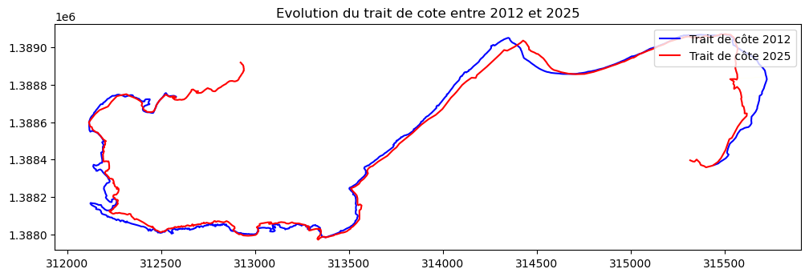
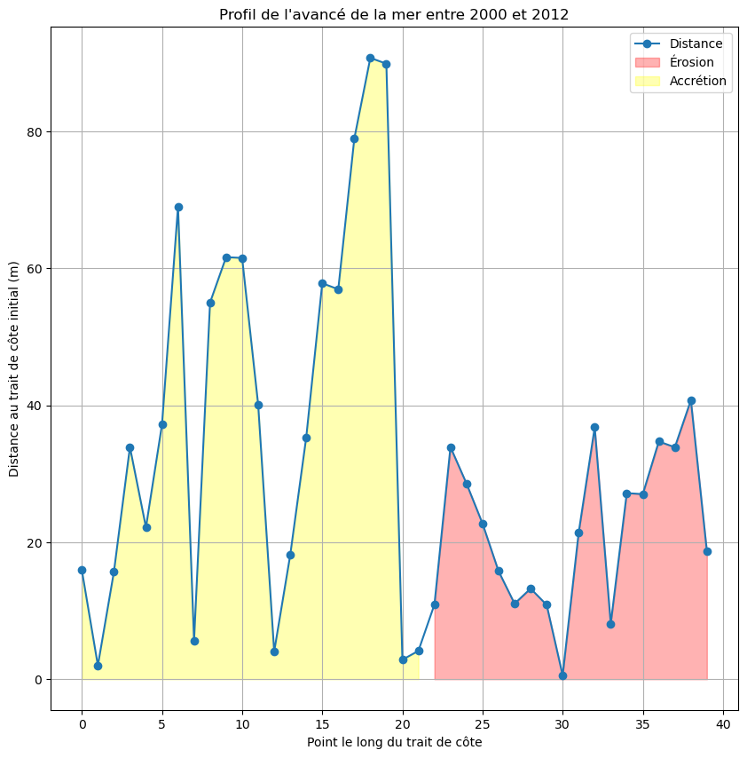

# 🌊 Analyse de l'Érosion Côtière et Dynamique du Littoral - Île de Carabane

### 📌 Présentation du Projet
Ce projet, réalisé dans le cadre du Master 1 à l'USSEIN en collaboration avec l'ONG JVE(Jeunes Volontaires pour l’Environnement ), porte sur l'étude de la vulnérabilité environnementale de l'île de Carabane (Estuaire de la Casamance). L'objectif est de quantifier le recul du trait de côte et d'identifier les pressions anthropiques et naturelles subies par le littoral.

### 🛠️ Méthodologie & Outils
* **Télédétection** : Acquisition et traitement d'images satellitaires pour le suivi temporel du littoral.
* **Analyse de Données (Python)** : Utilisation de scripts Python pour le calcul des taux d'érosion et la visualisation des profils de plage.
* **Collecte Terrain** : Identification des zones d'ensablement, état des mangroves et enquêtes participatives auprès des populations locales.
* **Logiciels** : Python (Pandas, Matplotlib), QGIS.

### 🚀 Points Forts
* **Approche Participative** : Collaboration directe avec les communautés locales et les autorités de Diembéring.
* **Expertise Scientifique** : Analyse de données spatio-temporelles complexes pour la recherche de solutions durables.

### 📊 Résultats & Travaux de Terrain

**Analyse du trait de côte (Code Python) :**

**Profils de plage générés :**

**Mission de terrain à Carabane :**

